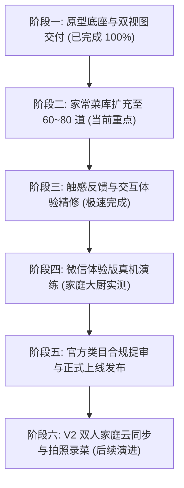

# 《四季三餐·好好吃饭》家庭点菜微信小程序 V2.03 全局实施规划 (Master Development Plan)

> **文档版本**：V2.03 (125道精选菜品与高清出锅视觉资产发布版)  
> **文档归档**：`docs/development-plan.md`  
> **更新时间**：2026-09-26  
> **核心定位**：解决 2 人家庭日常“今天/明天吃什么”决策难题，支持大厨午晚两餐大菜量、四大模式、厨师与采购双视图、双向独立备注、微信免密分享与大厨菜场打勾。

---

## 一、 整体产品与技术架构全景

```
┌─────────────────────────────────────────────────────────────────┐
│              《四季三餐·好好吃饭》全链路家庭点餐与交付系统                │
├─────────────────┬───────────────────┬───────────────────────────┤
│  1. 点餐决策中心│  2. 菜品交互中心  │  3. 交付协同中心          │
├─────────────────┼───────────────────┼───────────────────────────┤
│ • 明天/今天切换 │ • 单菜锁定 (Lock) │ • 🍳 厨师做饭看板 (带备注)│
│ • 4大餐桌模式:  │ • 单菜换一个      │ • 🛒 采购买菜清单 (带备注)│
│   3菜1汤/2菜1汤 │ • 菜库自选替换    │ • 菜市场打勾划掉交互      │
│   3个菜/3个炒菜 │ • 手动输入私房菜  │ • 微信小程序卡片免登录分享│
│ • 2人午晚两餐   │ • 历史去重与防重  │ • 复制微信格式化纯文本    │
│   1.8x分量模型  │   (正式开饭才入库)│ • 口语化单位(把/盒/头/块) │
└─────────────────┴───────────────────┴───────────────────────────┘
```

---

## 二、 阶段推进与里程碑全景路线



### 里程碑 1：原型底座与双视图交付（已完成并单测通过 ✅）
1. **完成项**：
   - 微信原生 TS 骨架、4-Tab 结构、生活化暖调样式体系；
   - 推荐算法引擎（硬过滤、川渝时令、四大模式、午晚两餐 1.8x 菜量）；
   - 菜单结果页（单菜锁定、单菜换一个、自选与手动输入 Modal）；
   - 交付中心（【厨师做饭看板】与【采购买菜清单】双视图切换，双独立备注输入与快捷标签）；
   - 大厨专属免登录页（`pages/cook/view`，支持微信卡片直接打开、买菜打勾、双视图与双备注展示）；
   - 全链路单测回归通过。

---

### 里程碑 2：高质量家常菜品库充实与去重保底（预计耗时 15 分钟）
1. **目标**：彻底消除使用 5~7 天后历史去重导致的候选池枯竭风险。
2. **具体任务**：
   - 将现有 30 道菜扩充至 **60~80 道** 常见高频川渝/全国经典家常菜：
     - **大荤补强**：粉蒸排骨、香菇滑鸡、酸菜鱼、白萝卜炖牛肉、盐煎肉、小酥肉等耐热大菜；
     - **副荤与蛋豆**：肉沫豆角、木须肉、肉沫豆腐、韭菜炒蛋、丝瓜炒蛋、青椒炒蛋；
     - **素菜与时令**：清炒茼蒿、蒜蓉西兰花、干锅花菜、素炒莴笋片、白灼菜心、酸辣藕丁；
     - **靓汤补强**：番茄丸子汤、紫菜蛋花汤、排骨山药汤、青菜豆腐汤。
   - 算法增加“动态去重保底”：当可选候选池不足时，自动放宽惩罚，确保 100% 稳定出菜。

---

### 里程碑 3：真机体验与触感细节打磨（预计耗时 10 分钟）
1. **具体任务**：
   - 买菜打勾增加震动触感反馈（`wx.vibrateShort`），大厨在菜市场买菜每勾一项有清脆震动感；
   - 结果页换菜增加轻量平滑微动效，防止连击防抖；
   - 全锁定状态下的友好提示（提示先解锁部分菜品）。

---

### 里程碑 4：真机实战演练与大厨使用验收（预计耗时 10 分钟）
1. **具体任务**：
   - 填入个人 AppID（或开启体验版）；
   - 手机扫码打开，排明天菜单，发给大厨微信；
   - 验证大厨端打开卡片是否能直接看到买菜打勾清单与做饭叮嘱。

---

### 里程碑 5：微信官方提审与全网发布（预计耗时 15 分钟准备）
1. **具体任务**：
   - 微信公众平台完善《用户隐私保护指引》（声明剪贴板权限）；
   - 服务类目选择【工具 > 便签/备忘录】；
   - 提交审核，等待 2~4 小时过审并发布。

---

## 三、 验收标准与交付矩阵

| 模块 | 核心验收动作 | 预期合格效果 |
| :--- | :--- | :--- |
| **排餐时间** | 首页点击“明天做饭”生成菜单 | 菜单标题明确显示“明天 (X月X日)”，计算匹配明天的时令与防重 |
| **四大模式** | 切换 3菜1汤、2菜1汤、3个菜、3个炒菜 | 槽位与烹饪方式严格吻合模式定义，3个炒菜全为干香下饭炒类 |
| **做饭/买菜双视图** | 结果页点击“就吃这些”进入交付页 | 顶部两个大 Tab 自由切换，分别可输入做饭叮嘱与买菜特别交代并支持快捷标签 |
| **大厨端专属查看** | 点击“微信分享给大厨”发给大厨微信 | 大厨无需登录，点开卡片秒开，能看到做饭叮嘱，且买菜支持手指打勾划掉 |
| **菜量保证** | 查看买菜清单与复制文本 | 食材按 1.8x 充足计算，单位口语化（1把、1盒、1头、1斤2两），大厨买菜顺畅 |
| **历史去重** | 连续 7 天模拟点菜开饭 | 60+ 道菜库保证每天不重样，撞菜率极低 |
