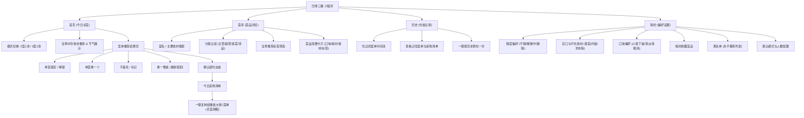
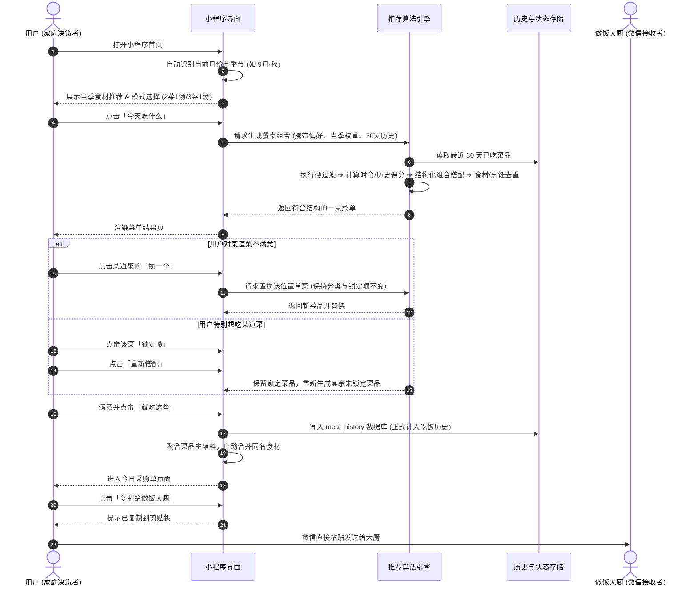

# 《四季三餐·好好吃饭》微信小程序 V2.03 产品规划方案 (Product Plan)

> **文档版本**：V2.03  
> **文档归档**：`docs/product-plan.md`  
> **更新时间**：2026-09-26  
> **核心定位**：根据季节和两个人的口味，每天自动搭配一桌家常菜的微信小程序。

---

## 一、 产品定位与核心目标

### 1.1 核心痛点与问题界定
传统菜谱产品解决的是**“这道菜怎么做”**（重菜谱步骤、视频、长篇烹饪指南），而本项目解决的是**“我们两个人今天吃什么”**这一高频决策难题：
1. **决策疲劳**：每天饭前纠结吃什么，想不出新菜，缺乏灵感。
2. **缺乏时令搭配**：无法快速知晓当季哪些蔬菜最新鲜便宜，容易反季或千篇一律。
3. **搭配失衡与频繁重复**：同一周反复吃红烧肉或单一青菜；荤素、汤品、口味组合不协调。
4. **与做饭大厨沟通繁琐**：想好菜单后需要打字整理，还要二次计算买菜数量发给大厨。

### 1.2 核心目标用户与场景
* **目标用户画像**：2 人家庭（夫妻、情侣、合租二人等），日常自己做饭或雇请大厨上门。
* **高频使用场景**：每天上班通勤中或做饭前 10 分钟，打开小程序花费 **5~15 秒** 敲定今日 2 菜 1 汤或 3 菜 1 汤，一键生成采购清单并复制发给做饭大厨。

### 1.3 核心一句话
> **根据季节和两个人的口味，每天自动配一桌家常菜。**

---

## 二、 产品信息架构 (Information Architecture)



---

## 三、 页面结构与流转说明

V1 采用微信小程序经典的 **4 Tab 一级导航架构**，层级扁平，路径短：

### 3.1 页面清单与路由映射

| 页面路径 | 页面层级 | 页面名称 | 核心功能职责 |
| :--- | :--- | :--- | :--- |
| `pages/index/index` | 一级 Tab | **首页 / 点菜中心** | 极简首页：当前月份/节气与当季食材、2菜1汤/3菜1汤切换、“今天吃什么”生成触发 |
| `pages/menu/result` | 二级页面 | **菜单结果页** | 展示生成的餐桌组合、单菜锁定/换一个、整桌重置、确认“就吃这些” |
| `pages/menu/shopping` | 二级页面 | **采购清单页** | 原材料按同类合并展示、折算两人份份量、一键复制微信文本给做饭大厨 |
| `pages/dishes/index` | 一级 Tab | **菜库** | 浏览全部家常菜（150~200道）、分类筛选（主荤/副荤/素菜/汤）、搜索、收藏 |
| `pages/history/index` | 一级 Tab | **吃饭历史** | 按日期展示最近吃过的菜单，支持历史防重数据可视化与复用 |
| `pages/mine/index` | 一级 Tab | **我的 / 偏好** | 设置辣度、忌口食材、排除列表、默认搭配模式、收藏夹 |

---

## 四、 核心业务用户流程 (User Flows)

### 4.1 核心点餐与交付完整闭环流程



---

## 五、 关键交互规则与状态机设计

### 5.1 单菜锁定机制 (Locking State Machine)
- 菜单展示 3~4 个卡片，每个卡片具有独立的锁定状态 `isLocked: boolean`。
- **锁定行为**：用户点击 `🔒 锁定` 后，该位置被冻结。
- **重新搭配**：点击底部「重新搭配」按钮时，仅针对 `isLocked == false` 的槽位从候选池中重新计算推荐分并抽选，保持已锁定的菜品原位不动。
- **重置整桌**：如果所有菜均被锁定，提示“所有菜品已锁定，请先解锁部分菜品后再换”。

### 5.2 单菜换一个 (Replace Slot)
- 用户点击单个卡片的 `🔄 换一个`，算法在**同分类**（如当前槽位是“主荤”，只在“主荤”候选池中选）且**不与桌上其他菜主要食材冲突**的前提下，挑选下一得分最高的菜品填充该槽位。

### 5.3 确认机制（吃饭历史防重关键门禁）
> [!IMPORTANT]
> **历史写入原则**：只有用户明确点击**「就吃这些」**时，该桌菜单才写入 `meal_history` 表；中间随手点击“换一换”、“换一桌”等浏览动作绝不污染历史记录，确保历史去重算法的准确性。

---

## 六、 采购清单智能合并规格

### 6.1 食材合并逻辑
- 每道菜配置基础食材与份量（默认 2 人份），例如：
  - 青椒肉丝：猪里脊 200g，青椒 2个
  - 芹菜炒肉丝：猪里脊 150g，芹菜 200g
- 合并引擎按 `ingredientName` 标准名称聚合：
  - `猪里脊` = 200g + 150g ➔ 自动累加为 `猪肉约 350g`。
  - 同单位直接数值相加；计数单位（个/根/头）相加；非标单位（少许/适量）去重合并展示。

### 6.2 复制给大厨的输出文本格式规范
```text
大厨好！这是【明天 (9月26日)】做饭菜单（两人吃午晚两顿，菜量充足）：

🍳 今日做饭：
1. 青椒肉丝（微辣·下饭）
2. 番茄炒蛋（家常）
3. 清炒空心菜（当季推荐）
4. 冬瓜肉丸汤（清淡鲜美）
📝 给大厨的做饭叮嘱：少放盐

------------------
🛒 买菜清单：
• 猪肉: 7 两 (约 350g)
• 青椒: 2 个
• 番茄: 2 个
• 鸡蛋: 3 个
• 空心菜: 1 把 (约 1 斤)
• 冬瓜: 6 两 (约 300g)
• 葱姜蒜: 适量
📝 给大厨的买菜特别交代：番茄挑沙瓤的

💡 提示：绿叶青菜建议中午吃完，肉菜晚上热热吃依然很香！
辛苦大厨啦~
```

---

## 七、 MVP 范围界定 (V1.0 边界控制)

### 7.1 P0 必须实现 (MVP 核心范围)
1. **基础骨架**：微信小程序原生 + TypeScript 框架与轻量 UI 主题（米白/浅绿/暖黄风格）。
2. **两大数据集**：
   - 川渝地区 12 个月当季食材字典（`ingredients.json`）。
   - 150~200 道家常菜品数据库（`dishes.json`，冷启动内置）。
3. **点菜引擎**：
   - 支持日常模式（2菜1汤）与丰盛模式（3菜1汤）。
   - 本地规则 + 权重打分算法（时令匹配 30%、偏好 20%、历史去重 20%、合理搭配 15% 等）。
   - 单菜锁定（Lock）、单菜换一个（Replace）、换整桌（Reroll）。
4. **交付闭环**：
   - 确认菜单写入历史 `meal_history`。
   - 采购清单自动合并同名食材。
   - 一键复制到剪贴板，格式符合微信发给大厨的沟通习惯。
5. **历史与偏好**：
   - 30 天历史防重机制。
   - 辣度设置、忌口排除。

### 7.2 P1 后续迭代项 (V1 稳定后开展)
- 收藏夹置顶推荐。
- 菜品标记“不喜欢 / 永不推荐”。
- 节气专题推荐卡片。
- 菜品库关键词搜索与分类筛选。

### 7.3 严格禁止的过度设计清单 (V1 绝不做)
- ❌ 不做外卖、商城、在线支付、配送（避免微信商业类目与食品许可证风险）。
- ❌ 不做长篇详细烹饪教程与复杂烹饪视频。
- ❌ 不做精确卡路里/减脂营养计算器。
- ❌ 不做社区、短视频、评论互动、点赞社交。
- ❌ 不做复杂 AI 大模型调用（V1 坚持本地规则引擎，确保毫秒级响应与稳定无怪异搭配）。
- ❌ 不强求每道菜高清配图（避免冷启动被素材阻塞，突出菜品名称与时令信息）。
